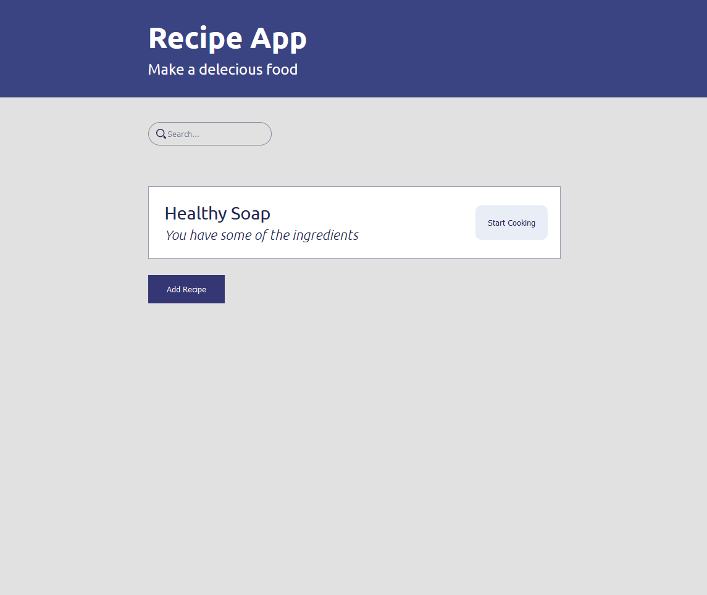
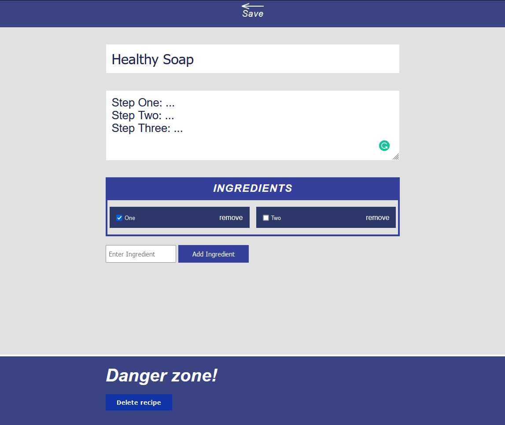

# Recipe App Project

   - After I finished my JS course the instructor asked for this project if someone could do it he gave us the idea and show a simple UI design So the hardest part for me in this project was colors because I intended to be a Front-End and I'm blind color so I hope The colors seem good

## Table of contents

- [Overview](#overview)
  - [The Project](#the-project)
  - [Screenshot](#screenshot)
  - [Links](#links)
- [My process](#my-process)
  - [Built with](#built-with)
  - [Continued development](#continued-development)
  - [Useful resources](#useful-resources)
- [Author](#author)

## Overview

- ### The Project

   - The project idea was to create a recipe app where the user can create any number of recipes he wants and he can manually change any thing in it by heading to the edit page and easily add, delete and

- ## Screenshot
   - Main page
    
   - Edit page 
    

- ### Links

   - Live Site URL: [Recipe App]()

## My process

   - ### Built with
     * Semantic Elements HTML5
     * CSS3 grid
     * Javascript

   - ### Continued development   
      - I'm going to learn React Library and then Node.js so  I could work as full-stack
      - Step two is to become a software engineer
   
   - ### Useful resources
      - Arabic 2020 
         - [HTML-Course](https://www.youtube.com/watch?v=6QAELgirvjs&list=PLDoPjvoNmBAw_t_XWUFbBX-c9MafPk9ji)
         - [CSS-Course](https://www.youtube.com/watch?v=X1ulCwyhCVM&list=PLDoPjvoNmBAzjsz06gkzlSrlev53MGIKe)
         - [JS-Course](https://www.youtube.com/watch?v=GM6dQBmc-Xg&list=PLDoPjvoNmBAx3kiplQR_oeDqLDBUDYwVv)

## Author

- LinkedIn - [@Omar](https://www.linkedin.com/feed/)
- Frontend Mentor - [@Omar](https://www.frontendmentor.io/home)